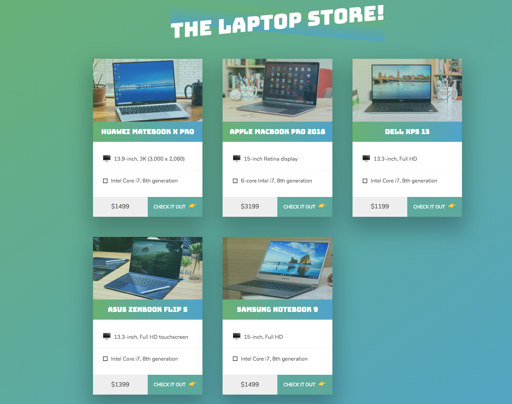

# laptop-store

This is a NodeJS project

### JavaScript Concepts used:
1. routing
2. backend JS

### Final Product:

### Future Developers:
 make sure node and nodemon are installed on your computer
 run `nodemon` to start the server on your terminal 
 then go to `127.0.0.1:1337` in browser 

